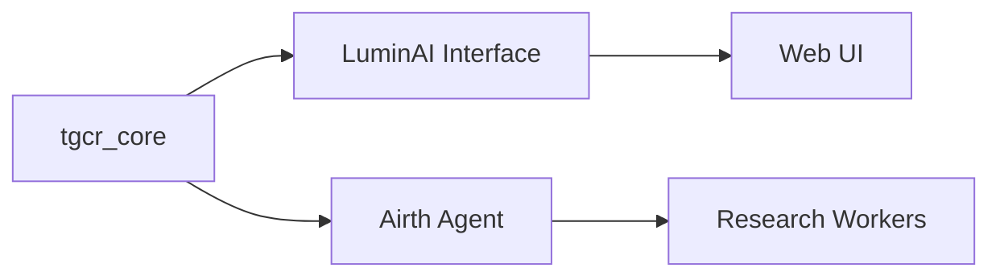

# TEC Architecture Map

This is a high-level overview of The Elidoras Codex architecture. It's a placeholder — add diagrams (Mermaid) and component docs.

## Components

- tgcr_core (src/tec_tgcr): core resonance algorithms and utilities
- luminai_interface (apps/luminai-interface): interactive UI and agent adapters
- agents (agents/manifests): agent manifests and runtime policies
- docs/: documentation and theory pages

## Suggested diagram (Mermaid)

Add data flow, provenance (manifest.yml) and deployment targets here.
